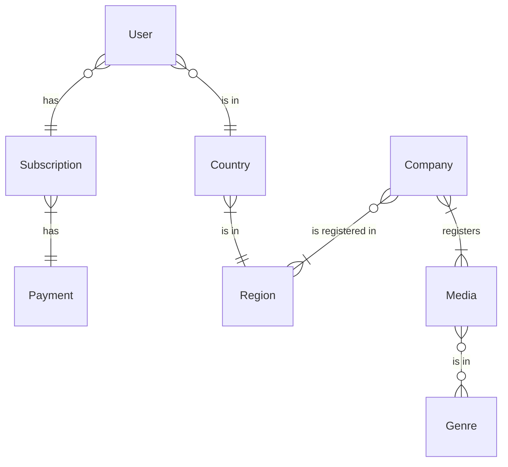

--- 
title: Nextflix High-level Design
geometry: a4paper,margin=2.5cm
---

# Nextflix High-Level Design

Revision 1.0 - Date 30/3/2023

## Table of Contents

- [Nextflix High-Level Design](#nextflix-high-level-design)
    - [Table of Contents](#table-of-contents)
    - [1. Introduction](#1-introduction)
    - [2. Requirements](#2-requirements)
        - [Functional Requirements](#functional-requirements)
        - [Non-Functional Requirements](#non-functional-requirements)
    - [3. System Architecture](#3-system-architecture)
        - [Presentation Layer](#presentation-layer)
        - [Data access Layer](#data-access-layer)
        - [Database design](#database-design)
    - [4. User Authentication and Authorization](#4-user-authentication-and-authorization)
    - [5. Data Storage and Management](#5-data-storage-and-management)
    - [6. Future Enhancements](#6-future-enhancements)
    - [7. Conclusion](#7-conclusion)

## 1. Introduction

Nextflix is a streaming platform that aims to provide users with a seamless media discovery experience. This high-level design document outlines the architecture and key components of Nextflix, focusing on the high-level system design and interactions between various modules. The goal is to create a scalable and robust web application that mimics the functionalities of popular streaming platforms like Netflix.

## 2. Requirements

This section outlines the functional and non-functional requirements of Nextflix. These requirements serve as a basis for the development and implementation of the application.

### Functional Requirements

- User Registration: Users should be able to create new accounts by providing necessary information such as username, email, and password as well as implementing third-party OAuth login strategies for user convenience.
- User Login: Registered users should be able to log in using their credentials.
- User Authentication: The system should authenticate users and generate a secure access token upon successful login. The token should be used for subsequent authorized requests.
- User Authorization: Only authenticated users should have access to protected resources and functionalities, such as media browsing and user profile management.
- Media Browsing: Users should be able to browse and search a wide range of movies and TV shows based on various categories such as trending, top-rated, genres, and release dates.
- Media Search: Users should be able to search for specific movies and TV shows using keywords, titles, genres, or other criteria. The search functionality should support advanced filters and sorting options.
- Media Details: Users should be able to view detailed information about specific movies and TV shows, including synopsis, cast, ratings, and related recommendations.

### Non-Functional Requirements

- Usability: The user interface should be intuitive, visually appealing, and easy to navigate. Users should be able to find and access media quickly and efficiently.
- Performance: The application should be responsive and provide fast loading times for media browsing, search, and retrieval.
- Security: User authentication and session management should be secure, protecting user accounts and preventing unauthorized access. The application should follow industry best practices for data privacy and protection.
- Scalability: The system should be designed to handle increased user traffic and a growing media library. It should be able to scale horizontally to accommodate higher loads.
- Reliability: The application should be highly available and minimize downtime. It should handle errors gracefully and provide appropriate error handling and messaging.
- Compatibility: The application should be compatible with a wide range of browsers, ensuring a consistent user experience across platforms.
- Maintainability: The codebase should be well-structured, modular, and maintainable. It should follow best practices for code organization, documentation, and version control.

These requirements provide a comprehensive overview of the desired functionalities and qualities of Nextflix. They serve as a foundation for the development process and guide the design and implementation of the system.

## 3. System Architecture

Nextflix follows a client-server architecture, with the frontend and backend layers interacting to deliver a cohesive user experience. The system architecture consists of three main layers: the frontend layer, the backend layer, and the database layer.

### Presentation Layer

The frontend layer of Nextflix is built using Next.js, a React framework that enables server-side rendering and provides an efficient development environment. It handles the presentation of the user interface and allows users to browse and search movies and TV shows. The frontend layer communicates with the backend layer through HTTP protocols and API endpoints.

### Data access Layer

The data access layer of Nextflix consists of a database and a backend, the backend is developed using Express.js, a web application framework for Node.js. Express.js handles HTTP requests, routing, and server-side logic. It acts as an intermediary between the frontend layer and the database layer, processing user requests, performing operations on the data, and returning responses. The backend layer implements RESTful API endpoints to support functionalities like user authentication, media search and retrieval.

Nextflix utilizes MySQL as the relational database management system (RDBMS) to store and manage structured data. The backend interacts with the database through standard SQL practices like using prepared statements and creating connection object pools, this ensures integrity and efficient retrieval of data.

### Database design

The database stores information such as user profiles, media details, authentication credentials and payment logs.

## 4. User Authentication and Authorization

Nextflix employs jwt-based authentication to manage user sessions and authorize access to protected resources. Users register and log in using their credentials, and upon successful authentication, they receive a JSON Web Token (JWT). This token is included in subsequent API requests to authenticate and authorize the user's access. User authentication and session management are handled securely, preventing unauthorized access to user accounts and ensuring data privacy.

## 5. Data Storage and Management

MySQL serves as the central data repository for Nextflix. It stores structured data related to users, media, genres, and copyright information. The backend layer interacts with the database layer using SQL queries to retrieve and manipulate data. Data retrieval is optimized for performance and incorporates techniques like query parameterization and prepared statements to prevent security vulnerabilities like SQL injection.

## 6. Future Enhancements

Nextflix has the potential for several future enhancements, including:

1. User Recommendations: Implement a personalized recommendation engine based on user preferences, viewing history, and ratings to provide customized movie and TV show recommendations.
2. Social Interactions: Introduce social features that allow users to connect with friends, share their favorite movies, and participate in watch parties.
3. Advanced Search and Filtering: Enhance the search functionality to include advanced filters like filtering by actors, directors, or specific keywords within movie descriptions.
4. Multiple Language Support: Provide support for multiple languages to cater to a broader audience.

## 7. Conclusion

The high-level design of Nextflix highlights the system architecture, including the frontend, backend, and database layers. It emphasizes the use of Next.js, Express.js, and MySQL to create a scalable and robust web application. User authentication and authorization mechanisms ensure secure access to user accounts, while the data storage and management strategies optimize data retrieval and manipulation. The document also identifies potential future enhancements to improve the functionality and user experience of Nextflix.
