--- 
title: Nextflix User Manual
geometry: a4paper,margin=2.5cm
---
# Nextflix User Manual
## Table of Contents

- [Nextflix User Manual](#nextflix-user-manual)
    - [Table of Contents](#table-of-contents)
    - [Introduction](#introduction)
        - [The Customer Gateway Manual](#the-customer-gateway-manual)
            - [Elements](#elements)
                - [Navigation bar component](#navigation-bar-component)
                - [Page switcher component](#page-switcher-component)
                - [Hero banner component](#hero-banner-component)
                - [Media search widget](#media-search-widget)
            - [Screens](#screens)
                - [Home Page](#home-page)
                - [Movies Page](#movies-page)
                - [TV Shows Page](#tv-shows-page)
                - [Media Details Page](#media-details-page)
                - [Play Page](#play-page)
                - [Sign In Page](#sign-in-page)
                - [Sign Up Page](#sign-up-page)
                - [Trending Page](#trending-page)
                - [Media Search Page](#media-search-page)
                - [My Watchlist Page](#my-watchlist-page)
                - [Account Page](#account-page)
        - [Admin Panel Manual](#admin-panel-manual)
    - [Extra information](#extra-information)
        - [Legal](#legal)

## Introduction

The Nextflix application interface is separated into two frontend applications, a web based application for customers (regular users) to browse the media and a desktop application for admins and content managers to manage and make modifications to the media database.

### The Customer Gateway Manual

Nextflix's customer gateway consists of the following elements and screens:

#### Elements
##### Navigation bar component

This is the main navigation component. It appears in all pages accessible by a logged in user. It consists of links to the media pages on the left, and an input form for media search and icons for the account and session management on the right.

##### Page switcher component
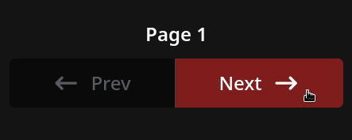

It's the main navigation component for media browser. It displays the number of the media page being currently viewed with right and left arrow buttons to switch between pages, these buttons are greyed out and disabled when there's to more pages to switch forward or backward to.

##### Hero banner component
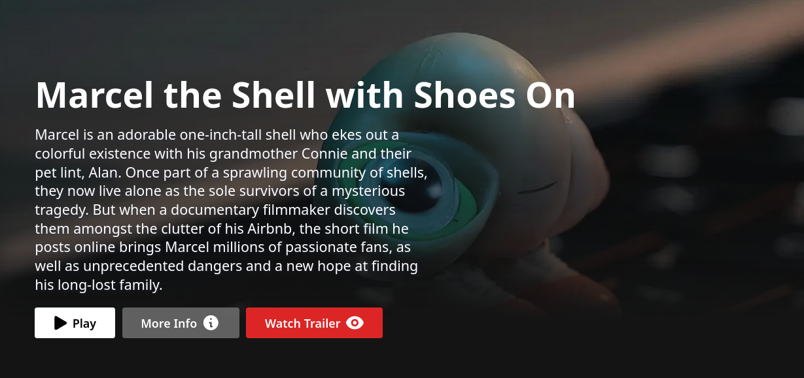

It's a component that displays a random media item from the most trending media of a specific category along with buttons to play it, see its details or watch its trailer, creating a preview reel of available media.

##### Media search widget

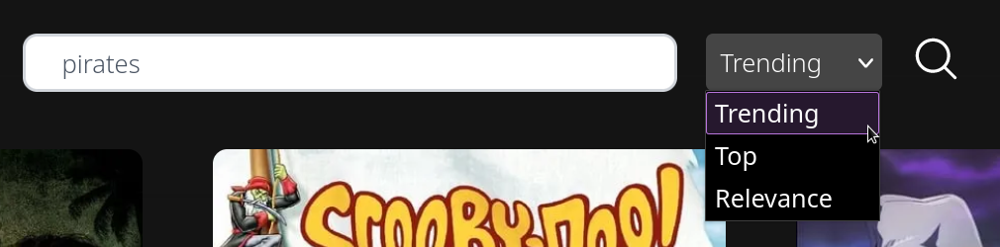
This is the detailed search component, it appears only at the top of the search page and a filter drop-down menu that switches search order between "relevance", "trending" and "top".

#### Screens
##### Home Page
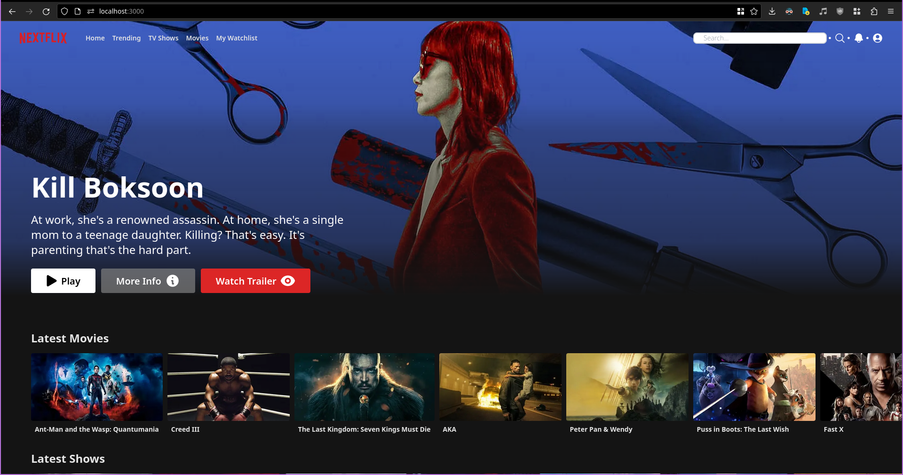
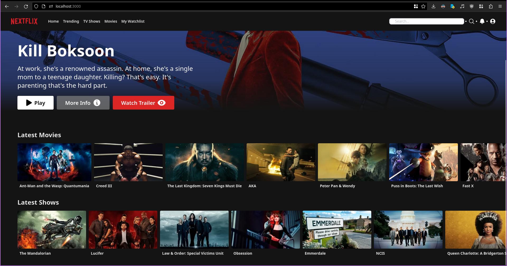

The home page displays two horizontal scroll rows of trending movies and TV shows each at the bottom, as well as a hero banner for both trending movies and TV shows.
##### Movies Page

The movies page is a variant of the home page that's dedicated only to movies, it displays a hero banner for trending movies and two rows of trending and top-rated movies, these lists can be clicked to switch to full dedicated pages for only trending and top-rated movies

##### TV Shows Page

The TV shows page is a variant of the home page that's dedicated only to TV shows, it displays a hero banner for trending TV shows and two rows of trending and top-rated TV shows, these lists can be clicked to switch to full dedicated pages for only trending and top-rated TV shows.

##### Media Details Page
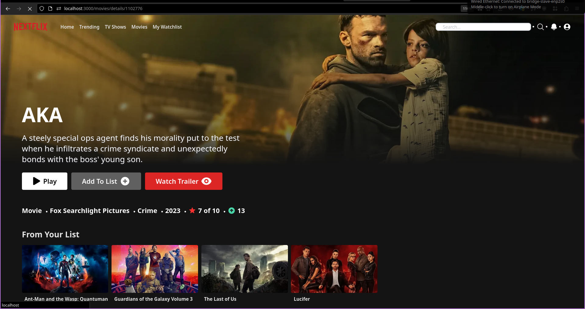

The media details page displays detailed information about a specific movie or TV show, including synopsis, ratings and genre below the main hero banner whose "More Info" button is replaced by the Add to List button. It also displays a list of media suggestions from the user's watchlist below the details.

##### Play Page
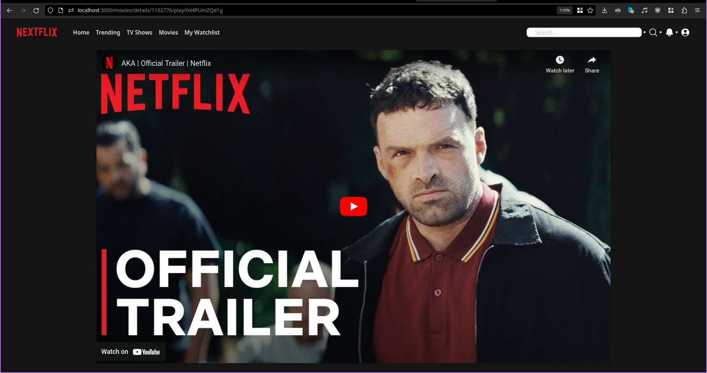

The play page is reached by pressing the play button of the hero banner. It displays a theater mode page with a video player for the selected media item. *Note that the play page displays the trailer in a youtube player because media playback wasn't included in the scope of this project.*

##### Sign In Page
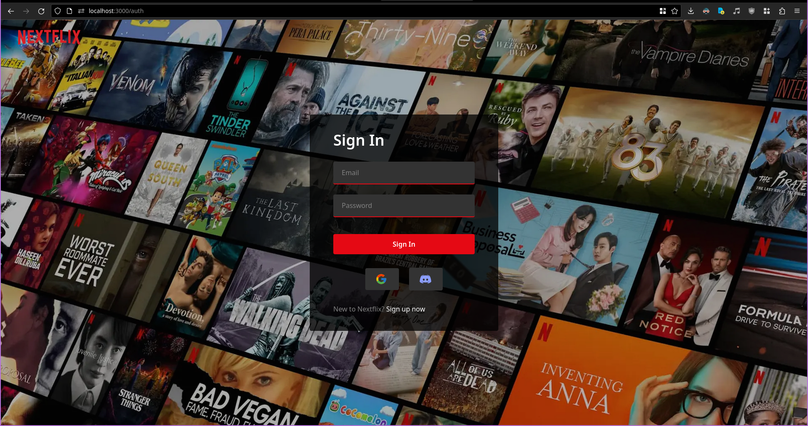

The Sign In page is the first page a user first using Nextflix sees. It consists of a form for logging in with an account, a link to the Sign Up page, and links to third parties Google and Discord to create an account through their auth services.

##### Sign Up Page
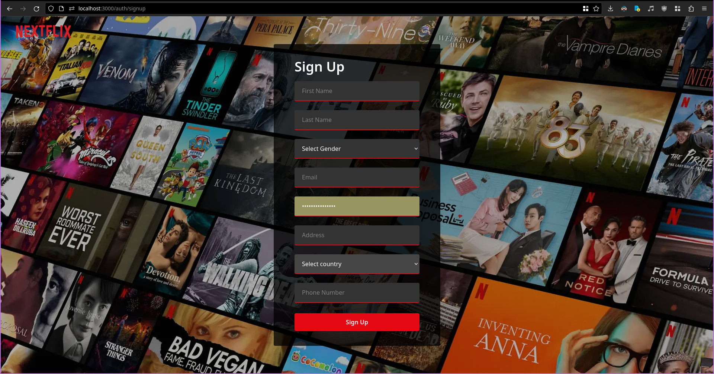

The sign-up page displays a form for a user to provide their details in order to create a new account natively using the backend layer's authentication.

##### Trending Page
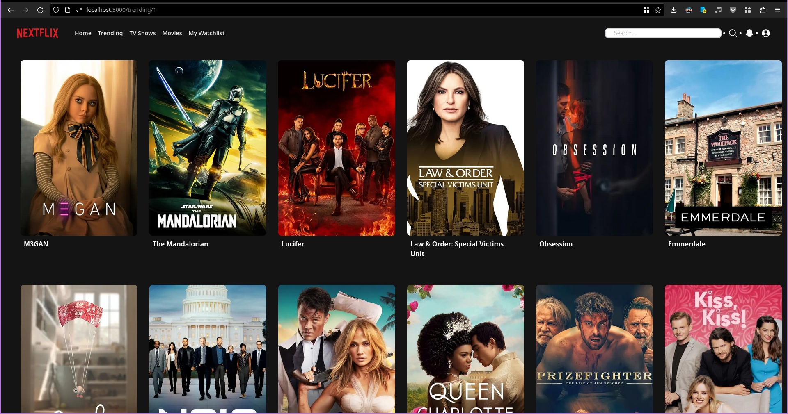

The trending page displays a grid of trending movies and TV shows followed by the page navigation component.

##### Media Search Page
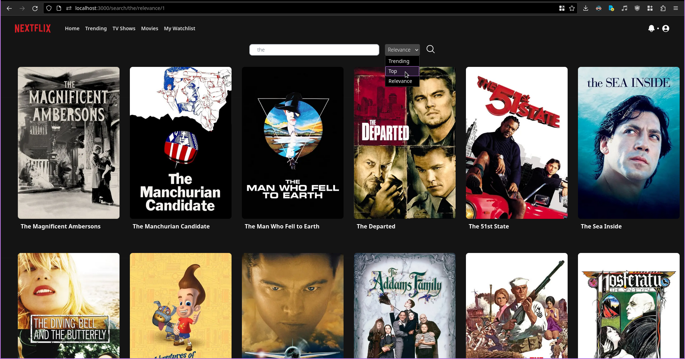

The media search page displays a grid of movies and TV shows that match the user's search query, below the media search widget. It also displays the page navigation component.

##### My Watchlist Page
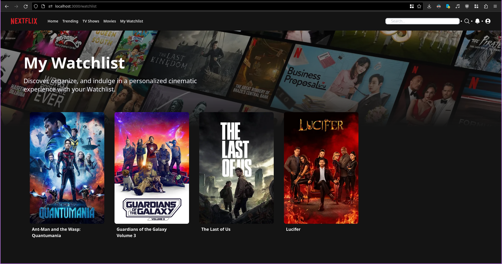

The watchlist page displays a grid of movies and TV shows that the user has added to their watchlist and the page navigation component.

##### Account Page
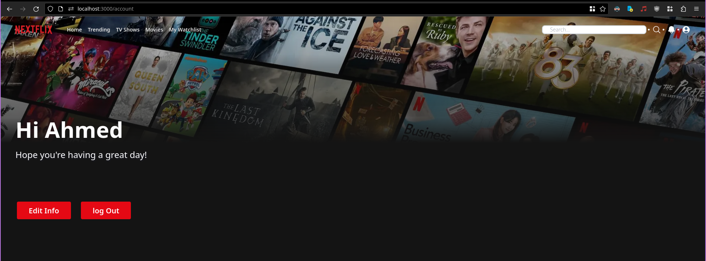

The account page displays the user's profile information and a logout prompt.

### Admin Panel Manual
The admin panel consists of two screens: 
- a form for company agents that are saved in the database to log in  
  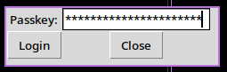
- another for for adding media to the database  
  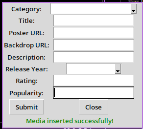  
The admin panel connects directly to the database deployment and submits the media details through prepared statements, every company agent saved in the database has their secret key that they log in as well as the ID of the company they're representing. The company ID of an agent is fetched when they login, so that every piece of media they add is associated with their company, automatically getting its availability in search configured.

## Extra information
### Legal
Every piece of media displayed to end users is filtered by availability according to licensing and copyright agreements in the user's country, so not all users in all regions have access to all the media available in the Nextflix database.